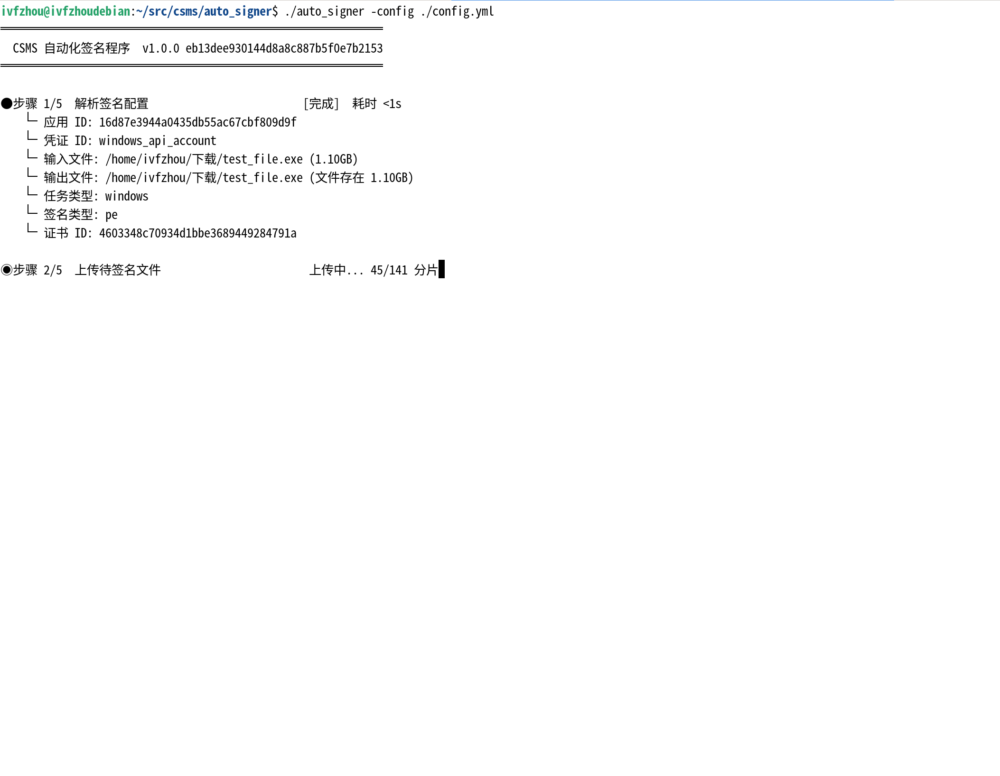
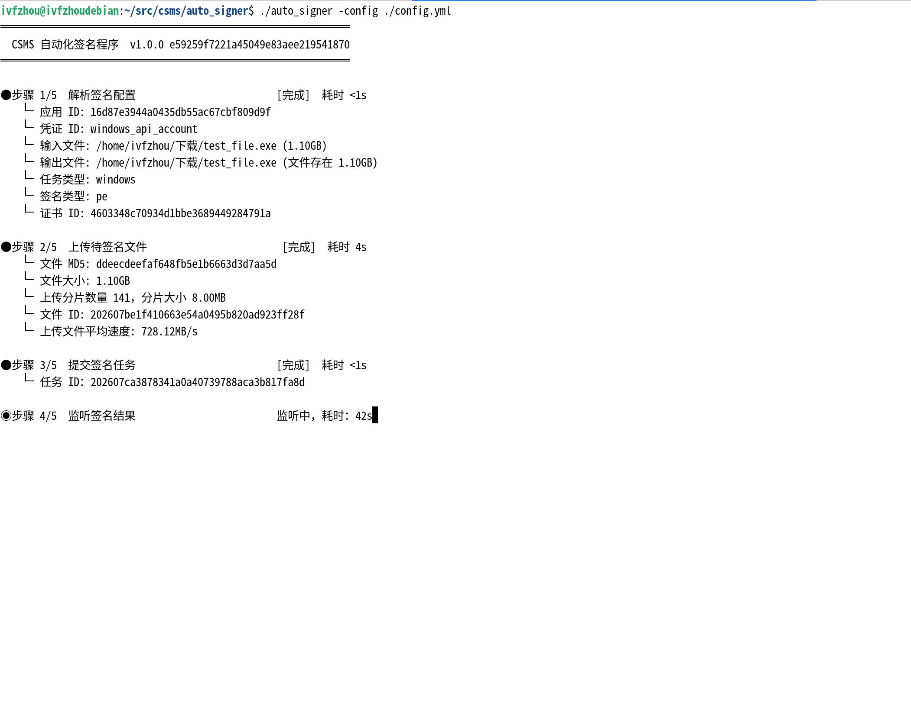
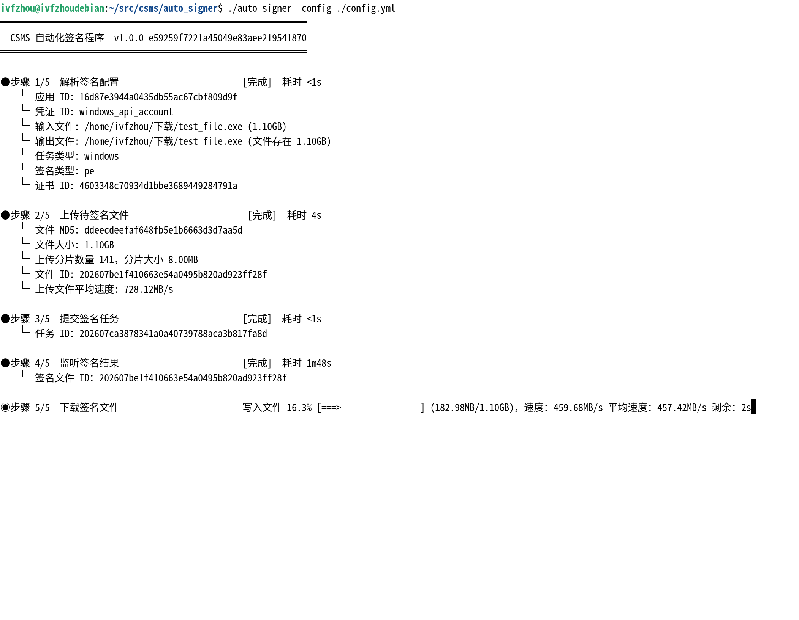
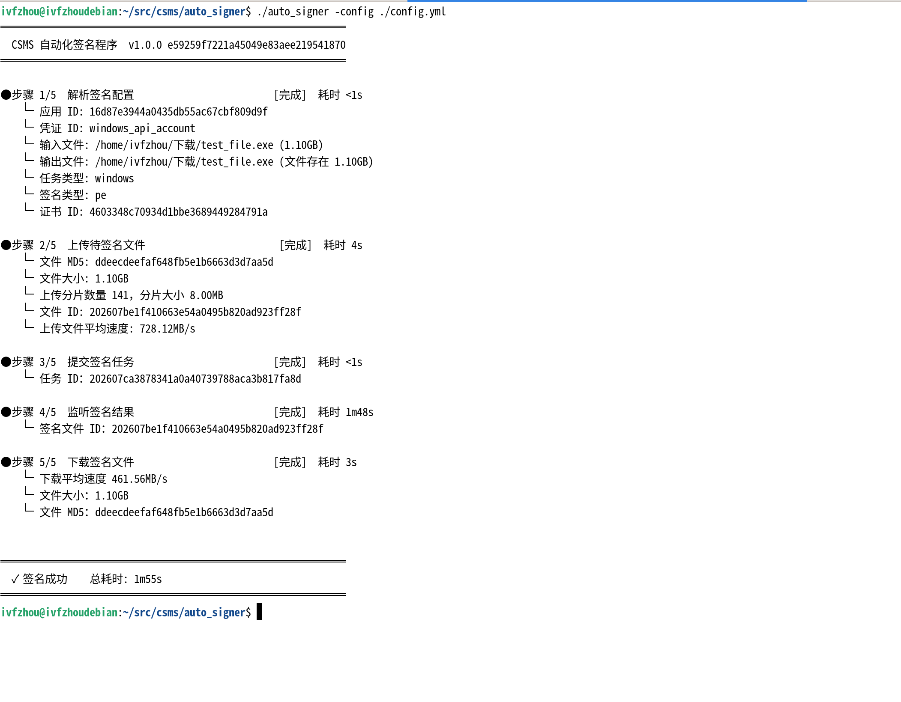
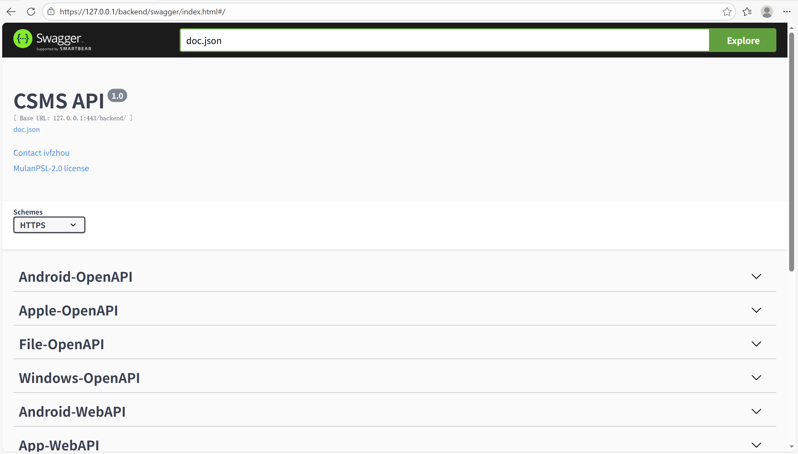

# 一、说明

本代码库根据论文【[数字证书签名及管理系统的设计与实现.pdf](./数字证书签名及管理系统的设计与实现.pdf)】实现。详细需求与设计请参见论文。

关于单元测试：测试范围为业务功能逻辑，包含了 route、filter、api、service 等包逻辑。不包括与第三方服务接口的逻辑，也就是与 MySQL、Redis、Tusd、HTTP Client、RabbitMQ、Fastlane 等的交互使用了模拟数据。单测目的是确保功能的表现与预期一致。

关于 服务 HTTP 接口测试：在第三方服务接口能实际使用的情况下，测试业务功能逻辑。在单机环境下，运行各类服务，然后发送 HTTP 请求模拟客户端行为，确保服务功能的表现符合预期。比单测环境更接近实际生产环境。

# 二、运行环境

|          工具           |     版本号     |
|:-----------------------:|:--------------:|
|     Development OS      |    Debian13    | 
|         Golang          |     1.26.5     | 
|          Java           | Temurin-25.0.2 | 
|          Ruby           |     4.0.1      | 
|         Node.js         |    v24.18.0    | 
|         Python          |     3.13.5     | 
|           Vue           |     3.5.32     | 
|         fatlane         |    2.227.2     | 
|          MySQL          |     9.7.1      | 
|          Redis          |     7.0.6      | 
|        RabbitMQ         |     4.3.2      | 
|          Tusd           |      v2.8      | 
|          Nginx          |     1.28.2     | 
|         ijhttp          |     2025.3     | 
|   Windows Driver Kit    |       10       | 
| Android SDK Build Tools |     36.0.0     | 

# 三、编译代码

1. 下载代码：
    ```shell
    curl -L https://gitee.com/ivfzhou/csms/repository/archive/master.zip -o csms.zip
    unzip csms.zip
    cd csms-master
    ```
1. 生成 GORM 代码：
    ```shell
    go run -C ./comm ./ -database ./database.sql
    ```
1. 生成 Swagger API 文档（[swag 命令](https://github.com/swaggo/swag)）：
    ```shell
    swag init -d ./backend,./comm -o ./backend/docs
    ```
1. 运行单元测试（需要有 JDK 环境）：
    ```shell
    go test -C ./backend -count=1 -v ./api
    ```
1. 编译代码：
    ```shell
    go build -o ./backend/backend ./backend
    go build -o ./fastlane_proxy/fastlane_proxy ./fastlane_proxy
    go build -ldflags "-X main.ServerAddress=https://127.0.0.1" -o ./auto_signer/auto_signer ./auto_signer
    go build -o ./hlk_manager/hlk_manager.exe ./hlk_manager
    go build -o ./sign_server/sign_server ./sign_server
    ```

# 四、运行服务

1. 启动 Redis、MySQL、RabbitMQ、Tusd、Nginx、Fastlane 服务。Nginx 配置参考文件 [nginx.conf](./nginx.conf)。
1. 按需修改中间件连接配置和服务配置。
1. 创建数据库表：
    ```shell
    mysql -u <enter your name> -p --default-character-set=utf8mb4 < ./backend/database.sql
    ```
1. 复制 [fastlane_proxy/Fastfile.rb](./fastlane_proxy/Fastfile.rb) 脚本：
    ````shell
    mkdir -p $HOME/fastlane
    cp ./fastlane_proxy/Fastfile.rb $HOME/fastlane/Fastfile
    ````
1. 启动主服务（本地测试可添加参数 -localTestMode -skipRateLimit），配置 [baclend/config.ini](./backend/config.ini)：
    ```shell
    cd ./backend
    ./backend -localIP 127.0.0.1 -config ./config.ini -messageFilesDirectory ./ -javaBinaryPath java -javaBinaryPathForPepk java -keytoolBinaryPath keytool -pepkJarPath ./pepk.jar -cabextractFilePath ./cabextract
    ```
1. 启动 fastlane_proxy 服务（本地测试可添加参数 -localTestMode），配置 [fastlane_proxy/config.ini](./fastlane_proxy/config.ini)：
    ```shell
    cd ./fastlane_proxy
    ./fastlane_proxy -localIP 127.0.0.1 -config ./config.ini -messageFilesDirectory ./ -fastlaneBinaryPath fastlane
    ```
1. 启动 hlk_manager 服务：
    - Hyper-V 虚拟机中将 hlk_manager.exe 程序注册为系统服务，且设置开机自启，以 Administrator 用户运行。
    - Hyper-V 虚拟机名称使用 IP 地址命名，例如：192_168_137_58。这将影响 PowerShell 脚本回滚虚拟机到检查点。
    - 各机器主机名改成 IP 地址命名，例如：192_168_137_106。这将影响 HLK Studio 中测试机器的名称，影响 PowerShell 脚本查找测试机器。
    - 测试机器需要开启 `bcdedit /set testsigning on`，以便驱动程序可以安装运行。
    - 虚拟机和宿主机之间网络防火墙放行。虚拟机可网络请求到 Nginx。
    - 搭建 HLK 时注意：确保一个测试 Windows 系统的版本 `system`，只关联一个 HLK 控制器。暂不支持多个 HLK 控制器关联同一个 Windows 系统版本。`system` 值参见：comm/model/enumerations.go#AllWHQLJobTestSystems
    - 以便程序可以处理人工交互测试项，测试机器需要开机时自动以管理员角色运行文件 [hlk_manager/dialog_handler.py](hlk_manager/dialog_handler.py)。参考 [hlk_manager/run_dialog_handler.cmd](hlk_manager/run_dialog_handler.cmd)，将其放置到用户 DTMLLUAdminUser 开机自启目录下。开机自动登录用户 DTMLLUAdminUser，参考[hlk_manager/DTMLLUAdminUser_auto_logon.reg](hlk_manager/DTMLLUAdminUser_auto_logon.reg)。
    - 搭建好 HLK 测试服务后，各测试器虚拟机设置检查点，检查点名称为 `init`。设置检查点时，确保虚拟机处于开机已登录状态，以便回滚检查点时自动开机。
    - 按需修改配置 [hlk_manager/config.ini](./hlk_manager/config.ini)。
    - 宿主机物理机运行：
        ```cmd
        cd .\hlk_manager
        .\hlk_manager.exe -mode HostMachine -localIP 192.168.137.1 -config .\config.ini -messageFilesDirectory .\
        ```
    - 控制机器虚拟机运行：
        ```cmd
        cd .\hlk_manager
        .\hlk_manager.exe -mode ControllerMachine -systems "Windows 10 22H2_64,Windows Server 2019_64" -localIP 192.168.137.58 -config .\config.ini
        ```
    - 测试机器虚拟机运行：
        ```cmd
        cd .\hlk_manager
        .\hlk_manager.exe -mode TestMachine -system "Windows 10 22H2_64" -localIP 192.168.137.106 -config .\config.ini
        ```
1. 启动 sign_server 服务，配置 [sign_server/config.ini](./sign_server/config.ini)：
    - Windows 签名服务。监听 Windows 证书表变动，自动刷新消费队列：
        ```cmd
        cd .\sign_server
        .\sign_server.exe -mode Windows -localIP 127.0.0.1 -config .\config.ini -signtoolFilePath .\signtool.exe -winevsignerFilePath .\winevsigner.exe -inf2CatFilePath .\inf2cat.exe -makecabFilePath .\makecab.exe
        ```
    - Android 签名服务：
        ```shell
        cd ./sign_server
        ./sign_server -mode Android -localIP 127.0.0.1 -config ./config.ini -apksignerFilePath apksigner -jarsignerFilePath jarsigner -javaHomeFilePath $JAVA_HOME
        ```
   - Apple 签名服务：
       ```shell
       cd ./sign_server
       ./sign_server -mode Apple -localIP 127.0.0.1 -config ./config.ini -zsignFilePath ./zsign
       ```

# 五、服务 HTTP 接口测试

1. 运行在 Linux 操作系统下。
1. 清空并重新创建数据库和表。
1. 启动各中间件服务。
1. 启动 backend 服务，启动参数添加 `-localTestMode -skipRateLimit`。
1. 启动 fastlane_proxy 服务，启动参数添加 `-localTestMode`。
1. 如果 Nginx 使用了自签名证书，须先将证书添加到 Java 证书信任库中：
    ```shell
    keytool -import -alias csms_ca -keystore $JAVA_HOME/lib/security/cacerts -file cert_csms_rsa.x509.pem
    ```
1. 然后运行 [ijhttp](https://www.jetbrains.com/ijhttp/download) 脚本：
    ```shell
    ijhttp ./testdata/all_api_test.http
    ```

# 六、自动化签名工具使用

运行签名工具，退出码非零表示运行签名失败，配置文件参考 [auto_signer/config.yml](./auto_signer/config.yml)：
```shell
./auto_signer -config ./config.yml
```
示例效果图：





# 七、发展展望

## 7.1、技术层面

1. 用户登录哈希算法改成采用 Argon2id 实现。
1. 采用微服务技术，代码实现改成采用 gRPC 技术栈实现。
1. 数据库表结构细化拆分。
1. 实现 Windows 相关软件文件的数字签名逻辑程序，在客户端提取文件摘要信息，服务端对摘要签名，然后客户端整合签名值进入文件。避免整个文件的传输。

## 7.2、功能层面

1. 实现 Harmony 平台相关证书管理、以及相关文件的签名功能。例如：鸿蒙包、证书、描述文件的申请。
1. 实现 Windows PE 文件的摘要式签名功能。

# 八、页面效果

Swagger 接口页面地址：https://127.0.0.1/backend/swagger/index.html



浏览页面：https://127.0.0.1/index.html 初始系统管理员账号密码为：`admin`。
